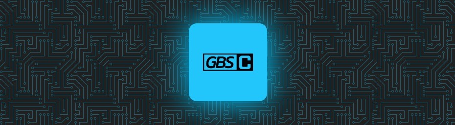
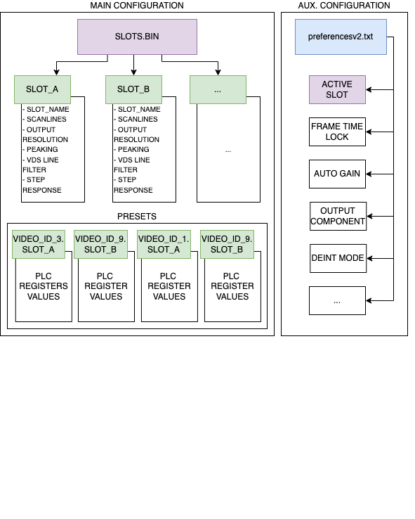

<p align="center">



</p>

<p>


</p>

## GBS-Control

GBS-Control is an alternative firmware for Tvia Trueview5725 based upscalers / video converter boards.  
Its growing list of features includes:   
- very low lag
- sharp and defined upscaling, comparing well to other -expensive- units
- no synchronization loss switching 240p/480i (output runs independent from input, sync to display never drops)
- on demand motion adaptive deinterlacer that engages automatically and only when needed
- works with almost anything: 8 bit consoles, 16/32 bit consoles, 2000s consoles, home computers, etc
- little compromise, eventhough the hardware is very affordable (less than $30 typically)
- lots of useful features and image enhancements
- optional control interface via web browser, utilizing the ESP8266 WiFi capabilities
- good color reproduction with auto gain and auto offset for the tripple 8 bit @ 160MHz ADC
- optional bypass capability to, for example, transcode Component to RGB/HV in high quality
 
Supported standards are NTSC / PAL, the EDTV and HD formats, as well as VGA from 192p to 1600x1200 (earliest DOS, home computers, PC).
Sources can be connected via RGB/HV (VGA), RGBS (game consoles, SCART) or Component Video (YUV).
Various variations are supported, such as the PlayStation 2's VGA modes that run over Component cables.

Gbscontrol is a continuation of previous work by dooklink, mybook4, Ian Stedman and others.  

Bob from RetroRGB did an overview video on the project. This is a highly recommended watch!   
https://www.youtube.com/watch?v=fmfR0XI5czI

Development threads:  
https://shmups.system11.org/viewtopic.php?f=6&t=52172   
https://circuit-board.de/forum/index.php/Thread/15601-GBS-8220-Custom-Firmware-in-Arbeit/   

## Theory of operation

### Slots vs Presets

- Preset - is a collection of predefined runtime values (including output screen resolution, etc).
- Slot - is a collection of presets.

When you connecting a new device, GBS tries to identify the input video signal. There are 9 signal types (VIDEO_ID), which also used to identify preset for current slot while saving/loading preferences.

While managing slots the following principles must be taken into account:

1. General parameters of a SLOT are stored in slots.bin, where each of (SLOTS_TOTAL) slots has structure:
     
    1.1. slot name\
    <!-- 1.2. input video signal ID (VIDEO_ID)\ -->
    1.2. output resolution\
    ... etc.
    
     Each slot has its own SLOT_ID which is one character long. The input video signal ID (VIDEO_ID) is not stored in slots. 
     
     > This allows to use multiple presets with the same slot, when current preset depends on the input video signal ID.
     
2. Preset file names are formatted as `input_video_format.SLOT_ID`, for example:

     - preset_ntsc.SLOT_ID
     - preset_pal.SLOT_ID
     - preset_ntsc_480p.SLOT_ID\
     ...etc.

3. Current/Active SLOT_ID and other auxiliar pararmeters are stored in preferencev2.txt file.

The following diagram represents structure of custom/user configuration:




## Build and Upload<a id="build-n-upload"></a>

>***PRO Tip:***\
You may consider using the latest compiled binaries from [/builds](./builds/) directory.

### Using Platformio IDE (preferred)

>***Please note:***\
If your objective is to make changes to the Project, please use VSCode + Platformio IDE.

1. Clone the repository, open it with your VSCode and press Build/Upload. It's never been easier :)

>***Please note:***\
Platformio IDE enables upload speed limitation on ESP8266. Upload process at any higher upload speed will fail.

### Using ArduinoIDE<a id="build-n-upload-arduino"></a>

1. Open "Preferences" in ArduinoIDE. In "Additional Boards Manager URLs" put the following source links:

```
https://dl.espressif.com/dl/package_esp32_index.json 
http://arduino.esp8266.com/stable/package_esp8266com_index.json
```

2. Save and close Preferences window. Go to the "Board Manager" and search for ESP8266. Make sure that the latest version of the framework installed.
3. Download/clone the following repositories into your Arduino libraries directory (see: "Preferences - Sketchbook location" + libraries). 
For more intfrmation please refer to http://www.arduino.cc/en/Guide/Libraries

```
https://github.com/Links2004/arduinoWebSockets.git
https://github.com/pavelmc/Si5351mcu.git
https://github.com/ThingPulse/esp8266-oled-ssd1306.git
```

If you plan to be using ping-library (see: HAVE_PINGER_LIBRARY in options.h) in addition to the above clone/download the following sources:

```
https://github.com/bluemurder/esp8266-ping.git
```

4. In menu "Tools" select the board "LOLIN(WEMOS) D1 R2 & mini". Then change "Flash size" to "4MB (FS:1MB OTA:~1019KB), "CPU frequency" to 160MHz, "SSL Support" to "Basic SSL cyphers".
5. Now remove src/main.cpp file. Arduino IDE will NOT compile your project if you omit this step. You can always restore main.cpp from main repository/active branch.
6. Build/Upload the Project.


## Translations and UI locale

WebUI currently can be translated using ```translation.json``` file in the Project root directory. If you wish to add a translation, please use tag-SUBTAG format (IETF BCP 47 standard) for locale names.

### Platformio IDE (preferred)

By changing value of "ui-lang" parameter in ```configure.json``` you're changing current UI translation. You also may change the UI font the same way ("ui-font").

>***Please note:***\
The default translation is "en-US".

### Arduino IDE

If you're still using Arduino IDE you need to do a few extra steps to generate/change UI locale. Please follow the steps below:

1. Make necessary changes in ```translation.json```
2. Make sure you have installed the latest version of Python on your machine
3. Install ***pillow***:
   
```
python -m pip install pillow
```
   
4. Build UI 

```
python /scripts/generate_translations.py --fonts=YOUR_FONT your-LOCALE
```

5. Now you're ready to build and upload the firmware.


## WebUI

Make sure the latest version of ```node-js``` installed on your machine. The following will do all the preparations automatically and it's the same in all environments, however the conversion scripts for Windows are not ready yet (see: public/scripts).

### Using Platformio IDE (recommended)

You can use "Platform - Build or Upload Filesystem Image" command in Platformio menu to get the web-interface re-generated and uploaded. Either you may use the manual method described below.

### Manually build WebUI

If any changes were made, run the following command in Project root directory to update the web-interface:

```
npm run build
```

#### Uploading via Arduino IDE

1. Download the latest release of (ESP8266LittleFS.jar](https://github.com/earlephilhower/arduino-esp8266littlefs-plugin/releases).
2. Copy JAR file into your Arduino tools directory (see: "Preferences - Sketchbook location" + tools)
3. Restart Arduino IDE, open [gbs-control.ino](./gbs-control.ino) file.
4. From the Tools menu, select “ESP8266 LittleFS Data Upload“. The contents of [/data](./data/) directory will be converted into a binary image file and the upload process will begin.


## OTA update

>***A work of warning:***\
Do not interrupt the network connection or upload process while updating via OTA. Your device may stop working properly.

Make sure you've enabled OTA mode in Control panel of GBSС.

### Using Platformio IDE

1. Open [platformio.ini](./platformio.ini) and uncomment ```upload_protocol, upload_port``` options. Option ```upload_port``` should be equal to the IP address of your GBSС (ex.: upload_port = 192.168.4.1)
2. Now go to "Platformio - Build and Upload" the firmware.

### Using Arduino IDE

1. Open sketch (gbs-control.ino). Make sure you already completed the steps 1-5 from ["Build and Upload - Using Arduino IDE"](#build-n-upload-arduino)
2. Go to "Tools - Ports". At the very end of dropdown menu find and chouse your device.
3. Proceed with build/upload.

For more details visit: https://github.com/JAndrassy/ArduinoOTA/blob/master/README.md

## Additional information

See [/doc/developer_guide.md](./doc/DEVELOPER_GUIDE.md).

## Old documentation

https://ramapcsx2.github.io/gbs-control