# TV5725 REGISTERS

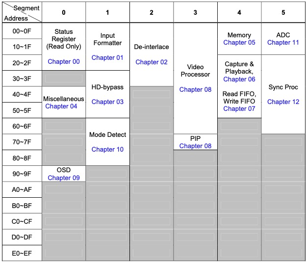

## (S0_41) Display clock tuning register

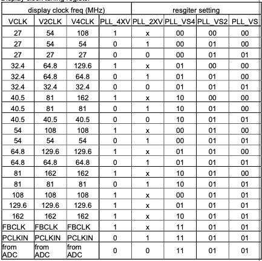

## (S0_90_1) Osd horizontal zoom select

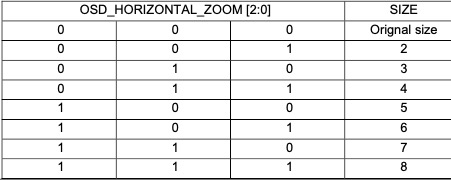

## (S0_90_4) Osd vertical zoom select

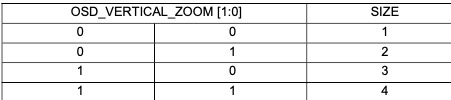

## (S0_91_0) Osd menu icons select

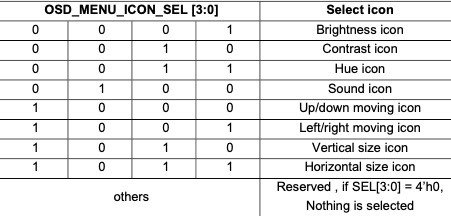

## (S0_91_4) Osd icons modification select

## (S1_00) Select 16bit data

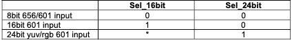

## (S1_01) Y data pipes control in YUV422to444 conversion

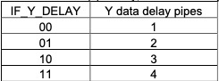

## (S1_02) Y data pipes control in YUV444to422 conversion

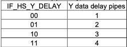 

## (S1_62) Horizontal Stable Estimation Error Range Control

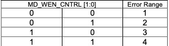

## (S2_00) Diagonal Bob Low pass Filter Coefficient Selection 

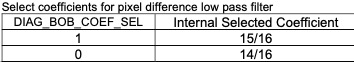

## (S2_17) Y delay pipe control

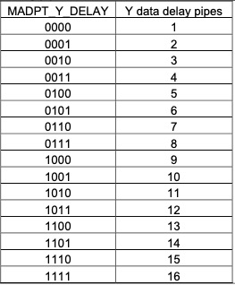

## (S2_17) UV delay pipe control

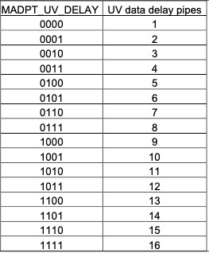

## (S2_3A) Delay pipe control for motion index feedback-bit

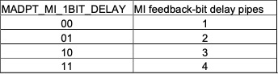

## (S2_3C) Motion index delay control

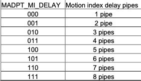

## (S3_00) External sync enable

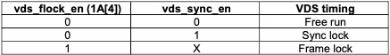

## (S3_1F) Programmable repeat frame number

## (S3_24_4) Y compensation delay

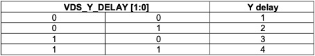

## (S3_24_6) Compensation delay control

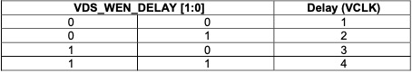

## (S3_2A) UV step response data select

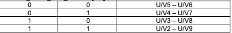

U/V2 is 2 clocks delay of input U/V, UV3 is 3 clocks delay of input U/V, and so on.

## (S3_32) SVM data generation select control

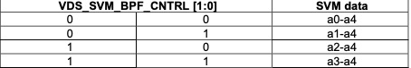

A1 is one pipe delay of a0, a2 is one pipe delay of a1, a3 is one pipe delay of a2, a4 is one pipe delay of a3, here a* is the input data y for generate SVM signal.

## (S3_40) SVM delay be V2CLK control

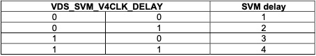

This field define the SVM delay from 1 to 4 V2CLKs

## (S3_55) Menu mode control for global still index

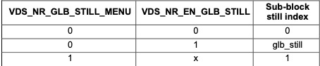

This bit is the user defined menu mode for global still signal, when it is 1, the global still signal is 1, the following is the detail.

## (S3_73) Blue extend range control bit 

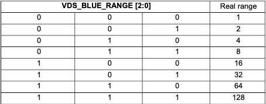

This field defines the range for blue extend.

## (S3_80) Y compensation delay control

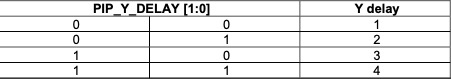

To compensation the pipe of UV, program this field can delay Y from 1 to 4 clocks.

## (S4_00) SDRAM Idle Period Control and IDLE Done Select

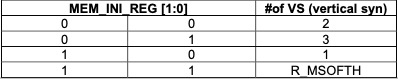

## (S4_28) Enable playback request mode

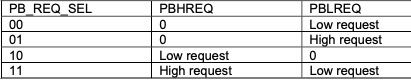

## (S4_4D_0) Read buffer page select from 1 to 16

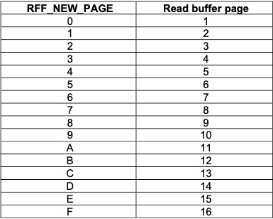

## (S4_4D_5) Enable read FIFO request mode

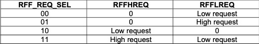

## (S5_16) CKO2 - PLLAD CKO2 output clock selection

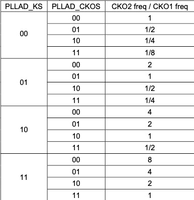

